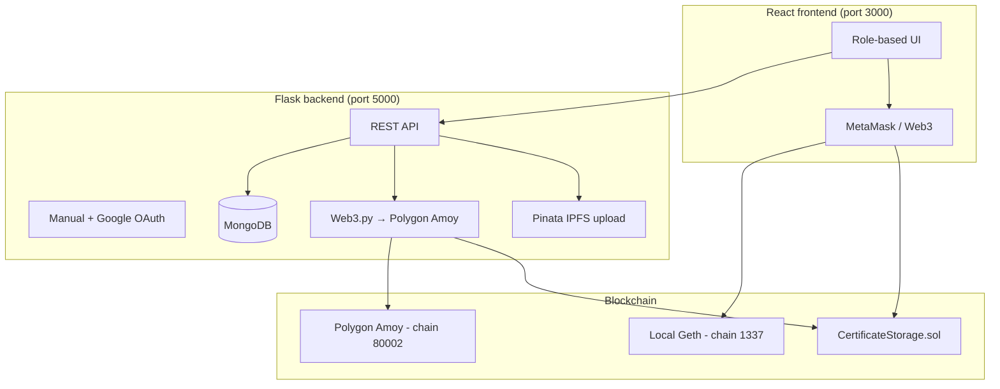

# EduChainGuard — Project Overview

This document describes **what EduChainGuard is**, **what it does**, **how it is built**, and **how the UI is organized**—including notes relevant to UI inconsistencies you may be seeing.

---

## 1. Project aim

**EduChainGuard** is an educational certificate integrity platform. Its goal is to let **institutes** register academic certificates in a **tamper-evident** way and let **verifiers** (employers, universities, auditors) confirm that a PDF they receive matches a hash stored on a blockchain.

Core ideas:

| Principle | How the project implements it |
|-----------|-------------------------------|
| **Immutability** | A certificate file is hashed with **SHA-256**. Only the hash is stored on-chain—not the PDF itself. |
| **Verification** | Anyone with the same PDF bytes can recompute the hash and check whether it exists in the smart contract. |
| **Audit trail** | Upload and verification events are also logged in **MongoDB** (metadata, user email, tx hash, timestamps). |
| **Flexibility** | Supports **Polygon Amoy** (server-signed transactions) and **local Geth** (MetaMask + chain ID **1337**) for demos and coursework. |

The product is aimed at **KLE / academic blockchain coursework**: local private chain setup (Geth + Truffle), optional public testnet (Amoy), and a React dashboard for role-based workflows.

---

## 2. High-level architecture



**Data flow (typical institute upload on Amoy):**

1. Institute selects a **PDF** in the admin UI.
2. Flask reads the file, computes **SHA-256**, saves a copy under `backend/uploads/institute/`.
3. Flask signs `uploadCertificate(bytes32)` on **Polygon Amoy** using a server wallet from `.env`.
4. MongoDB `uploads` collection stores email, filename, hash, and transaction hash.

**Data flow (local Geth + MetaMask):**

1. User connects MetaMask to **Geth Local** (RPC `http://127.0.0.1:8545`, chain ID **1337**).
2. Browser hashes the file in JavaScript (`crypto.subtle` / `hashFileSha256Hex`).
3. MetaMask signs the contract call directly; optional `POST /institute/record-upload` saves metadata to MongoDB without server-side signing.

---

## 3. User roles and functionality

| Role | Purpose | Main UI routes |
|------|---------|------------------|
| **admin** | Platform oversight: stats, user activity, charts, clear logs | `/admin/dashboard`, `/admin/tables`, `/admin/maps`, `/admin/settings` |
| **institute** | Upload certificate PDFs to the chain | `/admin/upload` |
| **verifier** | Upload a PDF and check if its hash exists on-chain | `/admin/verify` |
| **student** | Planned (see `ideas.txt`); sidebar currently shows **no links** for unknown/student roles | — |

### Authentication

- **Manual register/login**: `POST /api/auth/manual-register`, `POST /api/auth/manual-login` — password hashed with **bcrypt** in MongoDB.
- **Google OAuth**: `@react-oauth/google` on the frontend; backend verifies ID tokens (`google-auth`) at `/api/auth/google-login` and `/api/auth/google-register`.
- Session state is stored in **`localStorage`** as JSON (`user`: name, email, role)—not JWT cookies in the current implementation.

### Institute — upload certificate

- Accepts **PDF** (backend institute route) or PDF/image in some frontend paths.
- Computes **SHA-256** of raw file bytes (must match between browser and server).
- Writes hash to **`CertificateStorage`** via `uploadCertificate(bytes32)`.
- Stores record in MongoDB `uploads` collection.

### Verifier — verify certificate

- Accepts PDF upload, hashes it, calls `verifyCertificate(bytes32)` on the contract.
- Returns `{ verified: true/false }`.
- Logs attempt in MongoDB `verifications` collection.

### Admin — analytics and maintenance

| Endpoint | Purpose |
|----------|---------|
| `GET /admin/stats` | Total uploads, verifications, users by role, recent uploads |
| `GET /admin/uploads-per-day` | Last 7 days upload counts (chart data) |
| `GET /admin/user-activity` | Users grouped by role with institute uploads |
| `GET /admin/user-activity-details` | Detailed per-user uploads/verifications |
| `GET /admin/verifier-activity` | Verifier users and their verification history |
| `DELETE /admin/clear-logs` | Clears `uploads` and `verifications` collections |

### IPFS (optional, separate from blockchain)

- Route: `POST /upload-to-pinata` — uploads a file to **Pinata** (V3 API or legacy pinning).
- Frontend page: `/upload-ipfs` (`IpfsUploadPage.tsx`).
- Requires `PINATA_JWT` or `PINATA_API_KEY` + `PINATA_SECRET_API_KEY` in backend `.env`.
- **Does not** automatically link IPFS CID to on-chain hashes in the current codebase.

---

## 4. Smart contracts

### Primary: `CertificateStorage.sol` (actively used)

```solidity
mapping(bytes32 => bool) public certificateHashes;

function uploadCertificate(bytes32 certHash) external;
function verifyCertificate(bytes32 certHash) external view returns (bool);
```

- Location: `blockchain/contracts/CertificateStorage.sol`
- Deployed via **Truffle** (`blockchain/migrations/2_deploy_certificate_storage.js`).
- ABI synced to `backend/contract_abi.json` and `frontend/src/abis/CertificateStorage.json`.

### Secondary: `CertificateVerifier.sol` (richer model, not wired to main UI)

- Stores student name, course, issuer, issue date, validity flag keyed by string ID.
- Supports revoke; **not** integrated with the main Flask upload/verify flow in the current app.

### Tooling

| Tool | Role |
|------|------|
| **Truffle 5.x** | Compile & migrate contracts |
| **Geth** | Local Ethereum node (`blockchain/genesis.json`, chain ID **1337**) |
| **genesis.json** | Initializes local chain (aligned with frontend “Geth Local” MetaMask preset) |

---

## 5. Complete tech stack

### Frontend

| Layer | Technology |
|-------|------------|
| Framework | **React 19** (Create React App / `react-scripts` 5) |
| Language | **JavaScript** + partial **TypeScript** (`.tsx` for newer UI pieces) |
| Routing | **react-router-dom** v6 |
| Styling | **Tailwind CSS 3**, **PostCSS**, **@tailwindcss/forms** |
| UI libraries | **Headless UI**, **Heroicons**, **Font Awesome**, **Lucide React**, **Radix Slot**, **class-variance-authority**, **clsx**, **tailwind-merge** |
| Animation / visuals | **Framer Motion**, **GSAP**, **Three.js**, **@react-three/fiber**, custom components (`falling-pattern`, `ethereal`, `background-boxes`, `shape-landing-hero`) |
| Charts | **Recharts**, **Chart.js** (legacy) |
| Blockchain client | **ethers v6**, **web3 v4**, MetaMask (`window.ethereum`) |
| HTTP | **axios** (where used), mostly `fetch` to `http://localhost:5000` |
| Auth | **@react-oauth/google**, **jwt-decode** |
| Build | **Create React App** (Webpack via react-scripts) |

**Default dev URL:** `http://localhost:3000`

### Backend

| Layer | Technology |
|-------|------------|
| Runtime | **Python 3** (virtual env at repo root `.venv` or `backend/venv`) |
| Framework | **Flask** |
| CORS | **flask-cors** |
| Database | **MongoDB** via **pymongo** (default DB name: `educhain`) |
| Blockchain | **web3.py** v6 → Polygon **Amoy** (chain ID **80002**) |
| Auth | **bcrypt**, **google-auth** (OAuth ID token verification) |
| Config | **python-dotenv** (`.env`) |
| File uploads | **werkzeug** `secure_filename`, PDF-only for institute route |
| IPFS gateway | **requests** → Pinata REST APIs |
| Other | **PyJWT** listed in requirements (reserved for future JWT use) |

**Default API URL:** `http://127.0.0.1:5000`

### Blockchain & infrastructure

| Component | Technology |
|-----------|------------|
| Smart contracts | **Solidity** ^0.5.0 |
| Dev framework | **Truffle** ^5.11.5 |
| Local node | **Go Ethereum (Geth)** — HTTP RPC `127.0.0.1:8545` |
| Public testnet | **Polygon Amoy** (`https://rpc-amoy.polygon.technology`) |
| Wallet (server) | Private key in `backend/.env` for Amoy gas |
| Wallet (client) | **MetaMask** browser extension |
| Decentralized storage (optional) | **Pinata** IPFS pinning |

### Supporting files & utilities

| File | Purpose |
|------|---------|
| `hash_generator.py` | CLI helper to SHA-256 hash a PDF for testing |
| `TASKS_CHECKLIST.txt` | Step-by-step setup for Geth, Truffle, MetaMask, `.env` |
| `ideas.txt` | Planned features and open design questions (duplicate certs, OTP, AI extraction, chatbot) |
| `data/test_certificates/` | Sample PDFs for demos |

### External services (configured via `.env`)

- **MongoDB** — user accounts, upload/verification logs  
- **Polygon Amoy RPC** — on-chain writes/reads from Flask  
- **Google Cloud OAuth** — social login  
- **Pinata** — optional IPFS uploads  

---

## 6. Repository structure

```
EduChainGuard/
├── frontend/                 # React SPA
│   ├── src/
│   │   ├── App.tsx           # Top-level routes
│   │   ├── views/            # Pages (admin, auth, verifier, landing, IPFS)
│   │   ├── layouts/          # Admin, Auth, IpfsUpload shells
│   │   ├── components/       # Navbar, Sidebar, charts, UI demos
│   │   ├── utils/            # blockchain.js, web3, routeForRole
│   │   └── abis/             # CertificateStorage ABI
│   └── package.json
├── backend/
│   ├── app.py                # All Flask routes
│   ├── contract_abi.json
│   ├── requirements.txt
│   ├── .env.example
│   └── uploads/institute/    # Saved PDFs
├── blockchain/
│   ├── contracts/            # Solidity sources
│   ├── migrations/           # Truffle deploy scripts
│   ├── truffle-config.js
│   ├── genesis.json          # Local chain ID 1337
│   └── gethdata/             # Local node data (runtime)
├── data/test_certificates/   # Sample files
├── hash_generator.py
├── TASKS_CHECKLIST.txt
└── ideas.txt
```

---

## 7. API reference (summary)

| Method | Path | Description |
|--------|------|-------------|
| GET | `/test` | Health check |
| POST | `/api/auth/manual-register` | Email/password registration |
| POST | `/api/auth/manual-login` | Email/password login |
| POST | `/api/auth/login` | Alias for manual login |
| POST | `/api/auth/google-login` | Google ID token login |
| POST | `/api/auth/google-register` | Google registration with role |
| POST | `/upload` | JSON `{ hash }` → Amoy upload (generic) |
| POST | `/verify` | JSON `{ hash }` → on-chain verify |
| POST | `/institute/upload` | Multipart PDF + email → hash, Amoy tx, MongoDB |
| GET | `/institute/uploads/<email>` | List uploads for institute |
| POST | `/institute/record-upload` | Record MetaMask/local upload metadata |
| POST | `/verifier/verify-pdf` | Multipart PDF verify + MongoDB log |
| POST | `/verifier/record-verify` | Log client-side verify result |
| GET | `/admin/*` | Stats and activity endpoints |
| DELETE | `/admin/clear-logs` | Clear upload/verification logs |
| POST | `/upload-to-pinata` | IPFS upload via Pinata |

---

## 8. Environment variables

### Backend (`backend/.env`)

| Variable | Purpose |
|----------|---------|
| `PORT` | Flask port (default 5000) |
| `MONGO_URI`, `MONGO_DB_NAME` | MongoDB connection |
| `JWT_SECRET` | Reserved / future use |
| `CONTRACT_ADDRESS`, `WALLET_ADDRESS`, `PRIVATE_KEY` | Amoy contract + signer |
| `POLYGON_RPC_URL` | Amoy RPC endpoint |
| `GOOGLE_CLIENT_ID`, `GOOGLE_AUTH_ENABLED` | Google OAuth |
| `PINATA_*` | Optional IPFS |

### Frontend (`frontend/.env` / `.env.local`)

| Variable | Purpose |
|----------|---------|
| `REACT_APP_GOOGLE_CLIENT_ID` | Must match backend Google client |
| `REACT_APP_CONTRACT_ADDRESS_LOCAL` | CertificateStorage on Geth (chain 1337) |
| `REACT_APP_CONTRACT_ADDRESS_AMOY` | Optional Amoy address for wallet mode |

See `backend/.env.example` and `TASKS_CHECKLIST.txt` for full setup steps.

---

## 9. How to run (quick reference)

1. **MongoDB** — running on `mongodb://127.0.0.1:27017/`
2. **Backend** — `cd backend`, activate venv, `pip install -r requirements.txt`, configure `.env`, `python app.py`
3. **Frontend** — `cd frontend`, `npm install`, `npm start`
4. **Optional local chain** — init/start Geth, `cd blockchain && npx truffle migrate`, set `REACT_APP_CONTRACT_ADDRESS_LOCAL`

Detailed Windows/PowerShell steps are in **`TASKS_CHECKLIST.txt`**.

---

## 10. UI architecture and known inconsistencies

The UI issue you mentioned likely comes from **multiple design systems and template layers** coexisting in one app.

### Route map (`App.tsx`)

| Path | Page / layout |
|------|----------------|
| `/` | Dark “neon” home (`Index.js`) — FallingPattern, wallet status |
| `/auth/*` | Classic **Notus React** auth shell (`Login.js`, `Register.js`) |
| `/admin/*` | **Notus** admin dashboard (blueGray theme, sidebar) |
| `/landing` | Stock Notus landing (“Your story starts with us”) — **placeholder text** |
| `/profile` | User profile |
| `/upload-ipfs` | IPFS upload (newer TSX UI) |

Additional auth/marketing views exist but are **not** all wired in `App.tsx` (e.g. `IntegratedAuth.tsx`, `SignInGlass.tsx`, `WelcomeGate.tsx`, `Home.tsx`, `EtherealDemo.tsx`)—they are experimental or alternate designs.

### Visual themes (mixed)

| Area | Look & feel |
|------|-------------|
| Home `/` | Dark (`#050505`), neon green `#00ff88`, mono typography |
| Admin dashboard | Light **Tailwind Notus** (`blueGray-*`), white sidebar |
| Verify page | Uses `BackgroundBoxesDemo` (different aesthetic again) |
| Upload page | Modern cards (`InstituteUploadCard`, `WalletCard`) |
| Auth | Older Notus forms + separate shadcn token CSS file |

### Role-based navigation gaps

- **`Sidebar.js`** hides all links if role is not `admin`, `institute`, or `verifier` (e.g. **student** sees empty sidebar).
- **`Login.js`** may not navigate students anywhere useful after login.
- **Maps** and **Settings** routes are template leftovers with limited domain logic.

### Hardcoded API base

Many views use `const API_BASE = "http://localhost:5000"` instead of `process.env.REACT_APP_API_URL`—breaks if backend port or host changes.

### Blockchain UX messaging

- Home page copy emphasizes **local Geth (1337)**; backend institute upload uses **Polygon Amoy (80002)** when MetaMask local mode is off.
- Users can be confused about which chain their certificate was registered on.

### Planned UI-related work (`ideas.txt`)

- Password security improvements  
- Login/register visual polish  
- **Student role** search/lookup UI  
- Institute metadata (name, USN) on upload  
- Email OTP for manual register  
- Handling duplicate/revised certificates on-chain  
- Certificate text extraction (backend AI)  
- Career guidance chatbot  

---

## 11. Security and limitations (important)

1. **On-chain storage is only a boolean per hash** — no student name, course, or revocation in `CertificateStorage`.
2. **Re-upload loophole** — If an institute uploads a wrong PDF then a corrected one, **both hashes remain valid** unless you add revocation or “latest hash per student” logic (`ideas.txt` discusses this).
3. **Secrets** — Never commit `backend/.env` (private keys, Pinata JWT).
4. **Auth** — Client-side `localStorage` only; no httpOnly session cookies in current code.
5. **PDF-only** on server institute route; frontend may allow images in some flows.

---

## 12. Summary

| Question | Answer |
|----------|--------|
| **What is it?** | A blockchain-backed academic certificate registry and verification web app. |
| **Who is it for?** | Institutes (upload), verifiers (check), admins (monitor)—students planned. |
| **What is stored on-chain?** | SHA-256 hash of the certificate file (`bytes32` → `bool` mapping). |
| **What is stored off-chain?** | Users, upload metadata, verification logs, optional IPFS files, PDF copies on disk. |
| **Main stack?** | React + Tailwind + Flask + MongoDB + Web3 (Amoy + optional Geth) + Truffle/Solidity + MetaMask + optional Pinata. |

For UI fixes, prioritize **unifying design tokens**, **routing unused auth pages or removing dead code**, **student role navigation**, and **clear chain-mode indicators** (Amoy vs Geth) on upload/verify screens.

---

*Generated for EduChainGuard — May 2026*
